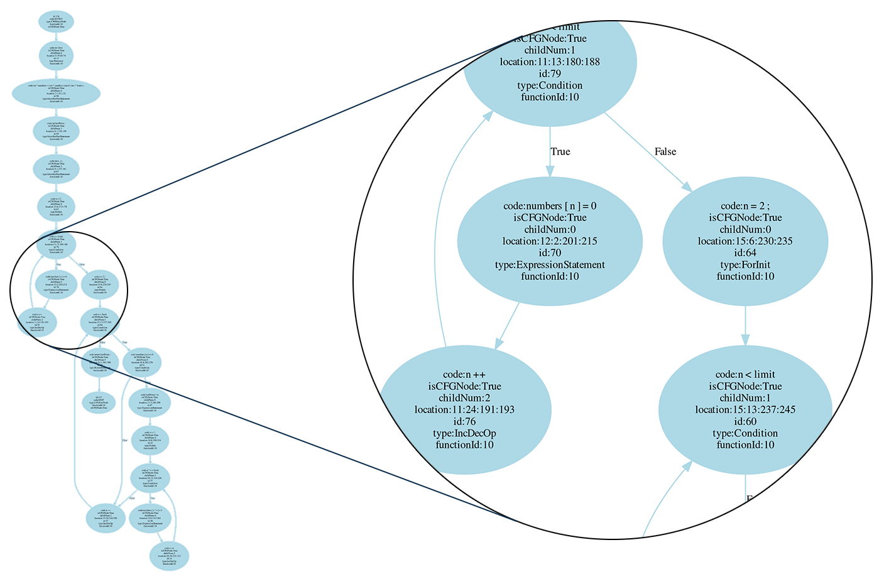
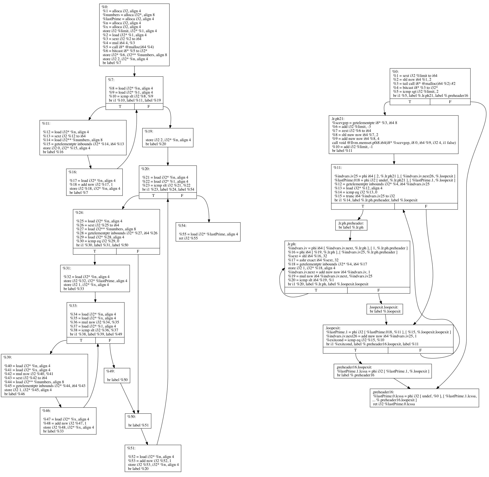
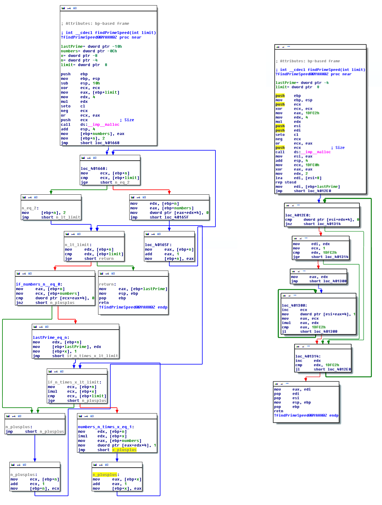

#二进制到源码的匹配分析技术


介绍
---------


## 1.介绍


**可执行二进制文件的分析和逆向工程在各种领域中具有广泛的应用，如计算机安全和取证。分析潜在的恶意软件样本或检查现有商业软件的破解等逆向工程安全领域的应用，它们几乎是通过二进制文件操作的。二进制程序的逆向工程通常是手动的，常被认为不能有效地应用于大型汇编的过程，非常耗时。然而，很多安全公司和反病毒厂商经常每天需要分析数千个未知的二进制文件，在快速的自动化分析二进制和逆向工程上有很大的需求。为此，在这两方面的设计和开发部分使用可靠的方法做了很多努力。代码重用指的是复制现有计算机程序部分代码，在没有或最少修改的情况下再次利用的过程。代码重用允许开发人员通过依赖以前编写或者测试通过的代码来实现程序功能，这样可以有效的减少软件所需要的开发和调试的时间。**


---


### 1.1 动机


计算机程序的源代码常常是用高级语言来编写的，源代码中偶尔也会有注释语句。因此，通过阅读源代码来理解一些程序的功能，比起阅读机器指令更加轻松、更加不易出错。

另一方面，正如稍后在第二章所需要讨论的，虽然巨大的开源代码库可供大众访问，但为了一些程序的二进制文件创建大型编译库仍然面临巨大的挑战。

因此，匹配复用二进制程序到其源代码将是加快逆向工程过程的一个有效方法。以前在这个领域的提议是遵从相对简单、相似相同的方法来匹配可执行性的二进制文件的源代码，并且除了个别少数有限的案例研究之外没被公开评估。此外，对于我们最好的知识，没有系统研究的可行性和从二进制程序的重用的代码片段匹配到源代码的挑战。


### 1.2 论文的声明


总之，本文的目的是，评估 自动化地比较在Intel x86平台上的可执行性二进制程序、开放\/已知的源代码用来检测代码复用，和匹配二进制代码片段到其各自的源代码可行性。为了达到这个目标，我们尝试回答一下问题：


* 问题1.计算机程序的共同特征或方面是什么？可以通过自动化方法，有效地从其源代码和可执行二进制文件中提取么？


* 问题2.编译和构建过程如何影响这些方面？从二进制到源代码的自动化转换的挑战是什么？


* 问题3.我们能否通过用大量极具特点、丰富的工作分析来改进现有的二进制到源代码转换的解决方法呢？


* 问题4.在某种程度上，我们能否用更好的二进制和源代码的匹配技术来检测代码复用，使现实中的二进制逆向工程更加容易？


### 1.3 贡献


1. 挑战的识别。我们探讨了编译和建立一个程序的过程，并已经展示了为什么之前工作中常用比较源代码的常用特征码或二进制代码片段的方法不能用于将源代码和二进制代码比较。我们也研究过，并在此描述了从大型开源库中自动提取功能的挑战，以及二进制到源码比较的技术并发性。

2. 新方法。我们探讨了通过研究用于比较源代码和二进制代码的附加功能来提高现在二进制和源代码匹配的可能性。并提出了一种新方法——**Codebin**，这和以前提议的方法不同，此方法尝试从语法匹配转移到源代码处理语法特征来揭示出更多代码复用的细节。

3. 实施。我们已经实现了**CodeBin**,并在任意二进制程序和代码库的代码基础上创建了一个能够实现自动匹配复用二进制函数与其源码的系统。我们实现的功能，可以自动分析和提取任意代码库，创建源代码特征的搜索索引，从分解的二进制文件中提取相关功能，匹配二进制函数和之前创建的源代码，并在一个可执行的二进制中概括地显示大多复用函数的源码

4. 评价。我们已经通过使用现有的开源代码模拟真实世界的逆向工程来评估**CodeBin**。通过二进制到源码匹配呈现代码重用检测地结果目前的检测结果来评估我们的方法的可行性。为此，我们从31个流行的软件项目中关联出数百万行的代码。其中12个二进制程序重复使用了以前的部分代码。这些都是使用了我们的最初版本的功能来检测，把复用的二进制函数转换成了源函数。总之，我们的系统通常能够独特地将超过60%的复用函数和源函数匹配，每匹配1000行代码需要1秒左右。在商用硬件上，我们还测试了该系统，反汇编二进制文件和分析的花费时间少于30分钟。我们已经在该系统上测试了三种没有复用代码的情况，并且研究了所有情况的结果。我们提出样本案例，而且描述了为什么我们的方法在某些情况下没达到预期，并讨论了未来工作的开展可能性。


### 1.4 大纲


本论文的其余部分组织结构如下：

* 第2章，包括一些关于源码如何被编译成机器可执行文件，二进制程序被转换成源码的一些难点、重点。
* 第3章，回顾了逆向工程领域和软件分析的相关工作，并讨论了之前二进制源转换的建议及其缺点。
* 第4章，致力于实现方法的制定，研究结果可以从源码和二进制文件中提取附加的共同特征做成索引，创建可搜索索引的方法，进行搜索。
* 第5章，讨论了技术的挑战性和实现的复杂性。第6章，提出评估结果的方法和收集数据检测。第7章，包括调查结果、评估结果，以及发展潜在的挑战。


---------------------------------------------


## 背景

## 2. 背景

### 2.1 软件的编译和构建过程

构建过程，通常指的的是用一种或者多种编程语言编写的软件源码转变成软件，且这个程序能在计算机运行的过程。一个重要的构建过程是编译，这个是用高级语言写的源码转换成计算机能运行的原有语言。目的代码过后可以进一步编译生成目的软件。

编程语言和运行平台平台的不同，构建过程存在很大的差异。举例来讲，用C语言编写一个的独立运行在Intel x86的平台的二进制文件，完全不同于用Java语言运行在Java虚拟机（Jvm）的程序。

我们的目标是促进二进制程序的逆向工程。C语言可以说是最流行的语言，常在x86平台上被用于编写机器可以执行的二进制文件。由于我们讨论的着重点，在本章节的剩余部分，我们就通过关注C语言作为源码在Intel x86平台构建程序的过程来讨论。

#### 2.1.1 高级源代码

计算机程序通常用高级编程语言编写，这些语言实现了计算机工作的抽象到具体的转变，允许程序员使用逻辑化的高级语义来编写程序。
我们在这里用一个简单的C语言代码示例讨论。在初期，这个示例和另外的一些程序，被用于寻找二进制程序转换成源码的方法。示例1，表示的是一个使用命令行接收整数，并用预分配的数组计算小于输入的最大素数的程序。程序的主要逻辑是寻找被封装在_findPrimeSpeed_函数中的目标质数，此函数使用limit来传参。

该程序依赖于其源码中导入的三个未定义的C语言标准库函数：malloc函数，动态分配内存；printf函数，格式化输出函数；atoi函数，将字符串转换成整数的函数。函数，既可以是结构体，又可以是通过`#include`预处理指令调用的其他源文件。

C语言源码编写可执行程序的第一步应当是预处理。每个C语言文件都适用于被`#include`调用。使用`#include`指令包含一个或几个其他的文件，预处理时候，该命令将代替文件中的内容。将指示预处理器简单地将指令行替换为包含头文件的内容。宏定义由是程序员定义的，它是用于替换任意代码的唯一标记，或在源码中使用`#ifdef`和`#ifdef`指令防止头文件的重复包含、编译。这些宏形成了C语言编程的一个组成部分，通常适用于很多情况，包括控制构建过程，封装平台依赖的所需代码。在如OpenSSL这些项目中，宏适用于减少繁琐重复的代码，提高工作效率。

```c
#include <stdio.h>
#include <stdlib.h>

int findPrimeSpeed(int limit) {

    int *numbers = (int *) malloc(sizeof(int) * limit);
    int lastPrime;
    int n, x;

    for (n = 2; n < limit; n++) {
    numbers[n] = 0;
    }

    for (n = 2; n < limit; n++) {
        if (numbers[n] == 0) {
            lastPrime = n;
            for (x = 1; n * x < limit; x++) {
            numbers[n * x] = 1;
            }
        }
    }

    return lastPrime;

    }
int main(int argc, char * argv[]) {
    printf("%d\n", findPrimeSpeed(atoi(argv[1])));
}

```

> 列表１：简单的Ｃ代码例子

#### 2.1.2 抽象语法树\(AST\)

一旦代码被预处理，词法分析器解析程序的源代码，文本遵从C语言语法规则被转换成解析树或具体的语法树，然后将解析树转换成语法树或抽象语法树。语法树基于其语法结构直接表现源码，它与解析树不同，它不会表现如注释、空格这些真实的语法细节，AST中的每个节点表示源码中的一个结构，并且可以表示从操作符到函数参数的所有名称。因此，获得AST对源码的任何分析都是至关重要的。


> 图1：列表１中findPrimeSpeed函数的抽象语法树，使用Clang [48]创建的。

#### 2.1.3 中介码\(IR\)

计算机程序可以以许多不同的形式表现。在编译的执行过程中，将代码翻译成其他语言，需要分析、合成，都免不了程序表现形式的紧密相连。编译器通常将代码转换为中介码（IR），也称为中介语言\(IL\)。用于编译器的中介码常独立于源码和转换的目标语言，可以针对不同的平台创建编译器。大多数的合成和分析都是通过这种代码形式来完成。

例如，GCC编译器使用了几种不同的中介码。这些中介码在整个编译的内部过程中使用来简化可移植性和交叉编译。IR和和GIMPLE当中，三位址码是一个简单的、以静单态赋值形式为基础的中介码，主要用于改进程式码转换效率，因优化特性而流行。另一个是LLVM中介码，在LLVM编译器基础结构中的唯一中介码，是一个强类型的RISC指令集。

#### 2.1.4 控制流程图\(CFG\)

控制流程图\(CFG\)是一个表现在程序执行期间的所有可能控制流的有向图。控制流程图通常被用于解释函数的构造。在CFG中，节点表示基本块，线表示从一个基本块到另一个基本块的可能控制流，也称为跳转。一个基本块始终按照指令列表顺序执行，开始于第一个指令，结束于最后一个指令。一个CFG可以从任何形式的代码创建，包括源码\(或AST\)、中介码、机器级的汇编代码。正如本章稍后要讨论的，CFG是表示一个函数或者一个程序的重要形式，通常用于逆向工程。

图2显示了创建的findPrimeSpeed函数的控制流程图，将代码解析为AST，并使用了[Joern](http://www.mlsec.org/joern/)将其转换为CFG。





```
                                           图2
```

#### 2.1.5 编译器优化

通常的编译器，特别是C编译器，能够自动执行各种代码优化，即最小化的转换执行代码所需的时间和内存，而不改变其语义。这些优化的实现通常是一系列转换通道。这个通道是将程序作为输入并产生输出程序的一种算法。优化前后的代码在语义上等价，但语法上不同的。

虽然运行的平台是影响优化的一个重要因素，但在大多数的优化中语言和平台是相互独立的。另一方面，为了保证语义原始，编译器在代码上能够执行多种数据流和趋势性的分析，大多数优化可以由中间语言提供便利；基于这两个原因，大多数编译器优化的实现都是通过中介码(IR)来完成。

由于编译器优化通常针对CPU和内存密集型,所以编译器通常允许程序员选择优化级别,这些选择影响编译完成所需的时间,以及输出的优化度。

编译器优化可能会使很多代码进行重大修改，包括其控制流程都有相当大的修改。大量更改会因为原始代码的质量、编译器优化的条件等编译器优化因素引入函数。

图3显示了findPrimeSpeed函数的两个控制流程图。图３的左侧图是从翻译C程序的源码获得LLVM IR的过程导出的，该过程并没有执行任何进一步的分析或优化。图３右侧是LLVM IR完全优化的导出图，表示的是LLVM的输出尽可能引入优化中介码(IR)的过程。类似地，图４显示的是使用微软ＶＣ编译器编写的x86程序派生出的findPrimeSpeed函数流程图，没有任何的优化。




> 图３　从LLVM字节码创建的findPrimeSpeed函数的控制流图。
左：没有任何优化。 右：具有完整的LLVM优化。

通过将LLVM IR的控制流程图(图３)和x86集合的控制流程图(图４)与原始的控制流程图比较，得到两个有趣的现象：

* **1.CFG语言独立性:**结合CFG的源顺序基本块，构建在结构上与LLVM IR或x86组件相同的、且未经优化的一个控制流程图。换而言之，控制流程图似乎是与语言无关的，它就是一个抽象的特征的表现形式，无论用什么语言编写的程序，都可以用它表示代码的流程。控制流程图的整体结构通常不受诸如x86指令集和低级的机器语言的复杂性影响，让人易于理解，这也是逆向工程中常用控制流程图呈现代码的重要原因。





> 图4：从Microsoft Visual C编译器的汇编输出创建的findPrimeSpeed函数的控制流图。左：没有任何优化。 右：完全（3级）优化。

* **2.编译器优化对CFG的影响：**

注意编译器优化如何显著改变了一个相当简单的函数控制流。通常，随着函数的复杂化，控制流变得越来越大，编译器被提供了更多的几率，将其转换成更优化的、语义等效的代码。因此，由于这些优化，增大了CFG的改变几率。即使似乎控制流程图(CFG)的结构与编程语言无关，但它还是不能有效地用来比较源函数和已经优化的编译器的函数。


#### 2.1.6 机器码

一旦独立于体系结构的分析和优化在中间表达时候被执行，代码就被传递到**机器码生成器**(机器码生成器，将中介码转换为目标平台的本地指令的编译器，且该指令包含在一个对象文件中)。在Ｃ语言和其他语言(如Fortran)，编译是在逐个文件的基础上完成的，每个源文件分别被翻译为中间码和目标语言(注:作者在中间码和目标语言之间用的是or/and，在理解中要考虑每个源文件分别被翻译成中间码和目标语言、中间码、目标语言这三种情况)。因此，对于表１中的简单示例，将仅创建一个对象文件。表２包含了findPrimeSpeed函数的部分汇编代码，该汇编代码具有Intel语法，它们由Clang/LLVM生成，并对Intel x86平台进行了优化。为了简洁，去除了与调用约定（[the calling convention](http://citeseerx.ist.psu.edu/viewdoc/download?doi=10.1.1.83.1755&rep=rep1&type=pdf)）相关的机器码的第一部分。


```shell
    mov    r14d, edi
    movsxd r15, r14d
    lea    rdi, [4*r15]
    call   _malloc
    mov    rbx,  rax
    cmp    r15d, 3
    jl     LBB0_6
    mov    rdi, rbx
    add    rdi, 8
    lea    eax, [r14 - 3]
    lea    rsi, [4*rax + 4]
    call   ___bzero
    dec    r14d
    mov    ecx, 2
    .align 4, 0x90
LBB0_2:    cmp    dword ptr [rbx + 4*rcx], 0
    mov    edx,1
    mov    rsi,rcx
    jne    LBB0_5
    .align 4,0x90
LBB0_3:
    movsxd ax, esi
    mov    dword ptr [rbx + 4*rax], 1
    inc    rdx
    mov    rsi, rdx
    imull  rsi, rcx
    cmp	   rsi, r15
    jl     LBB0_3
    mov	   eax, ecx

LBB0_5:
    mov    rdx, rcx
    inc    rdx
    cmp    ecx, r14d
    mov    rcx, rdx
    jne    LBB0_2
LBB0_6:
    add    rsp, 8
    pop    rbx
    pop    r14
    pop    r15
    pop    rbp
    ret
```

> 列表2：findPrimeSpeed函数的x86汇编代码的一部分
 

#### ２.1.7　链接

每个源文件创建对象文件，该对象文件包含可重定位的机器码且不能被直接执行。然后链接器负责链接各种目标文件和库，最终创建可执行的二进制文件。链接时间(link-time)优化的过程大多被称为过程间优化(IPO)，它们只能在链接期间执行，因为优化器具有程序的全部图像。链接时间优化，可以对中介码执行，也可以对对象文件执行。在任何情况下，链接器都会获取所有输入文件，并为每个目标创建一个可执行文件。

最简单的代码段依赖于**库**(库，即被集中定义的函数或者程序代码)。例如，我们的例子依赖的就是malloc、atoi和printf这三个库函数。库可以既可以被静态链接，又可以被动态链接。静态链接的库只是被简单地复制到二进制的镜像中，然后生成相对更加便携的可执行文件。而动态链接库只有它的符号名称被包含在二进制镜像中；并且在执行二进制文件的时候，它应当存在于系统中。

### 2.2　二进制到源码的匹配

之前介绍了软件构建过程的要点，现将二进制文件与复用的源码进行匹配的两个对立的想法结合进行讨论，以及讨论我们选择自动编译和自动解析的原因。

####2.2.1 自动编译

二进制程序中识别重用源码的一个思路是，通过编译源码获得二进制译文，然后再利用二进制克隆检测技术。在该项目早期阶段，我们已探讨了这个思路，但是面临着几个重大的困难。据分析，任意一个源码的自动编译都面临着很大的实际挑战。在此，我们将列举和阐述一些自动编译的关键性障碍点，这也说明了直接比较源码和二进制文件的困难度。

####2.2.1.1 多样的构建配置

如2.1.1节所述，C代码在解析之前会进行预处理，这个过程会受到宏的极大影响，所以自动编译系统面临着为自定义预处理宏获取一组正确值的巨大挑战。通常，这些宏的某些值集合包含在代码库随附的配置脚本中，并在运行实际构建脚本之前运行。

不同的工程使用不同的构建系统，这样就出现了各种各样的配置和构建方法。因此，不使用任何构建系统的知识，实际上是很难获得编译一段代码所需的宏。虽然[CMake[2]](https://cmake.org/)等现代构建系统提供了一种面向多个构建环境的跨平台方式，使构建过程高度标准化，但它们尚未被C/C++的代码库广泛采用。

####2.2.1.2 外部依赖

依靠外部库进行某些操作是非常常见的手法。这些外部依赖关系不一定包含在项目中，大多是需要自行下载，然后然后用兼容的方式编译。自动编译需要一个标准化的系统来检索和构建这些依赖关秀。这些依赖关系通常由构建自动化和依赖关系的管理脚本下载，或者由用户进行读取、安装。虽然标准依赖关系管理系统被其他语言广泛采用[[9](https://www.openhub.net/)，[35](https://pypi.python.org/pypi)，[57](https://maven.apache.org/)]，但C/C++项目尚未采用这种依赖关系管理系统，从而进一步阻碍了自动编译。


####2.2.1.3 交叉编译

在撰写本论文时(作者写论文的这个时期)，二进制克隆检测技术在应用于不同编译器、不同优化级别 不同的平台（如x86、ARM）等不同配置的二进制文件时通常是不可靠的[[31]]()。 另一方面，可能会有大量的候选工程通过搜索来运行。 在这种情况下，需要一个自动将所有源代码编译成二进制文件的解决方案，理想情况是使用不同的编译器和不同级别的优化。若某二进制文件的底层平台也未知，那就应该在不同的平台上构建项目，从中获取一个优质的二进制文件来匹配。


###2.2.2 自动解析

综上所述，我们不希望将目标源码编译成二进制文件，而是首先将源码和二进制文件做比较。因此，我们通过解析源码并遍历AST来提取关键特性，然后用于匹配。显然，自定义配置宏仍然是一个问题。但是，当只考虑AST创建时，创建机器执行码会出现问题，这是缺少关于宏的内容导致的，而不是阻塞引起的。在第五章，我们将以完全自动化的方式来解释获取AST的方法，无需访问预定义的自定义宏和头文件的位置。


